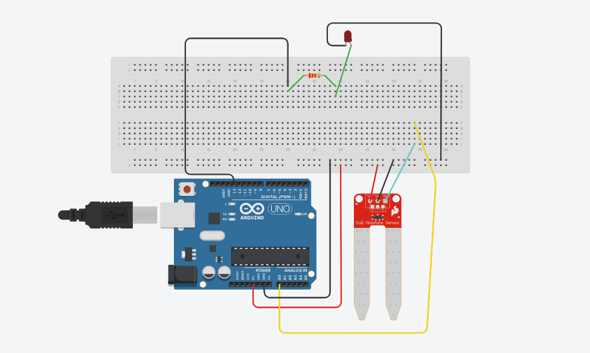
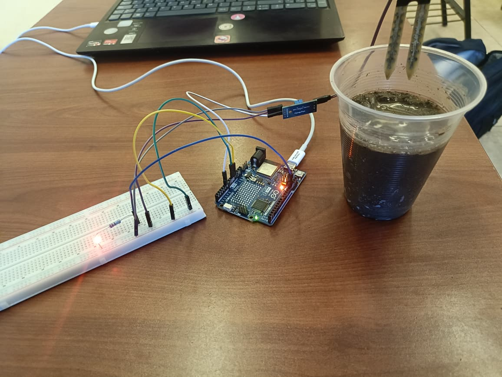
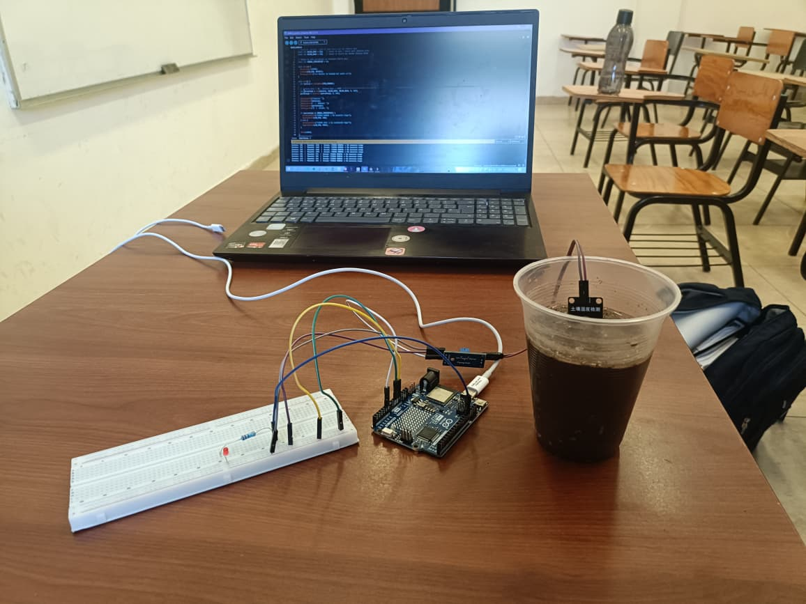
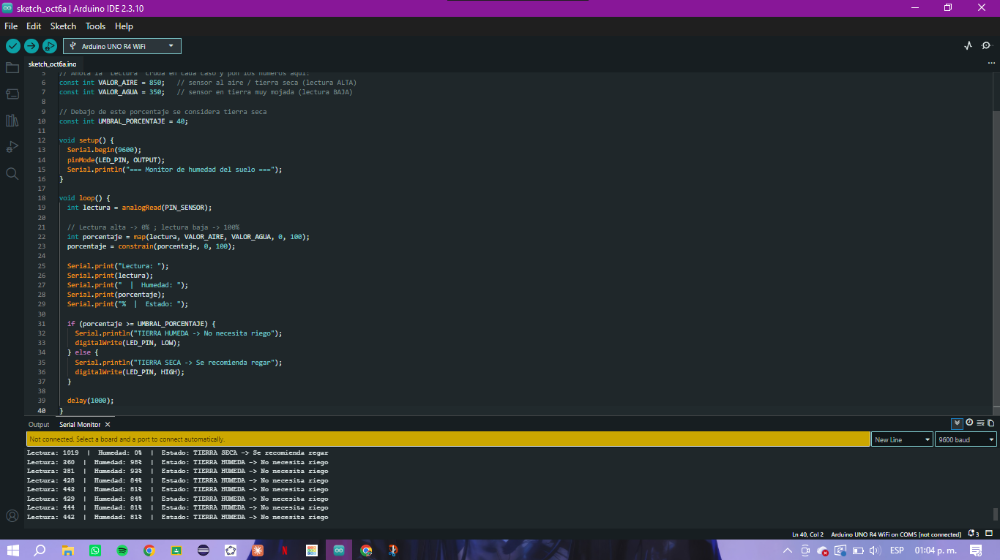

# Sensor de humedad de suelo con Arduino

**Materia:** Desarrollo Sustentable
**Autor:** Roberto Carlos Robles Campos

## 1. Descripción

Sistema con Arduino UNO R4 WiFi que mide la humedad de la tierra con un
sensor y la convierte a porcentaje. Cuando la humedad baja del 40 %, el
sistema considera que la tierra está seca: enciende un LED y avisa en el
Monitor Serie que se recomienda regar. Cuando la humedad vuelve a subir, el
LED se apaga.

## 2. Objetivos de aprendizaje

Leer una señal analógica con Arduino (sensor de humedad de suelo), calibrarla
y convertirla a porcentaje, y usar una condición para controlar una salida
digital (LED) como alerta de riego, como ejemplo de tecnología aplicada al
uso eficiente del agua.

## 3. Material utilizado

- Arduino UNO R4 WiFi
- Sensor de humedad de suelo (sonda con módulo)
- LED rojo
- Resistencia para el LED
- Protoboard
- Cables Dupont
- Vaso con tierra
- Cable USB y computadora (alimentación y Monitor Serie)

## 4. Conexiones

| Componente | Conexión en el Arduino |
|---|---|
| Sensor de humedad — alimentación | 5V |
| Sensor de humedad — tierra | GND |
| Sensor de humedad — señal | A0 |
| LED (con resistencia en serie) | Pin digital 13 → GND |



## 5. Funcionamiento del código

Código completo en [`codigo/humedad_suelo.ino`](codigo/humedad_suelo.ino).

1. Se lee el sensor en `A0` cada segundo (`analogRead`).
2. La lectura se convierte a porcentaje con `map()` usando dos valores de
   **calibración**: `VALOR_AIRE = 850` (sensor al aire o tierra seca, lectura
   alta, 0 %) y `VALOR_AGUA = 350` (tierra muy mojada, lectura baja, 100 %).
   `constrain()` mantiene el resultado entre 0 y 100.
3. Si el porcentaje es **mayor o igual a 40 %** (`UMBRAL_PORCENTAJE`), se
   imprime "TIERRA HÚMEDA, no necesita riego" y el LED se apaga.
4. Si es **menor a 40 %**, se imprime "TIERRA SECA, se recomienda regar" y el
   LED se enciende.

## 6. Evidencia de armado

Montaje con el sensor en la tierra húmeda y el LED encendido durante la prueba:



Montaje completo, con el código y el Monitor Serie en la computadora:



## 7. Resultados

El Monitor Serie muestra el cambio de estado: con el sensor al aire la
lectura fue de **1019 (0 %)** y se indicó "TIERRA SECA"; al meterlo en la
tierra mojada las lecturas bajaron a valores entre **360 y 444 (de 81 % a
98 %)** y el estado cambió a "TIERRA HÚMEDA".



## 8. Video del funcionamiento

[Ver la prueba en YouTube](https://youtu.be/H7qawTeFsaA) — "Sensor de humedad
de suelo con Arduino R4 WiFi".

Enlace también en [`video/enlace.txt`](video/enlace.txt).

## 9. Preguntas de reflexión

**¿Por qué la lectura es alta con la tierra seca y baja con la mojada?**
El sensor mide qué tan fácil pasa la corriente entre sus dos terminales. El
agua conduce mejor que el aire o la tierra seca, así que con más humedad el
valor que entrega este módulo disminuye. Por eso la calibración asigna la
lectura alta al 0 % y la baja al 100 %.

**¿Para qué sirve calibrar con `VALOR_AIRE` y `VALOR_AGUA`?**
Cada sensor entrega valores distintos según su fabricación y el tipo de
tierra. Medir los extremos reales (aire y tierra muy mojada) permite que el
porcentaje sea comparable y que el umbral del 40 % tenga sentido.

**¿Qué ventaja tiene usar un umbral en porcentaje en vez del valor crudo?**
El porcentaje es más fácil de interpretar y de ajustar: basta cambiar un
solo número para que el sistema avise antes o después, sin tener que
recalcular lecturas crudas.

**¿Cómo se relaciona con el desarrollo sustentable?**
Regar solo cuando la tierra lo necesita evita desperdiciar agua y reduce el
riego excesivo, que daña a las plantas. Es la base de los sistemas de riego
inteligente que cuidan este recurso.

## 10. Estructura del repositorio

```
├── README.md
├── codigo/
│   └── humedad_suelo.ino
├── imagenes/
│   ├── diagrama_tinkercad.png
│   ├── armado_led_encendido.jpg
│   ├── armado_completo.jpg
│   └── monitor_serie.png
├── video/
│   ├── enlace.txt
│   └── README.md          enlace clicable a la prueba en vivo
└── resultados/
    └── Resultados.pdf     lo aprendido en esta práctica
```
